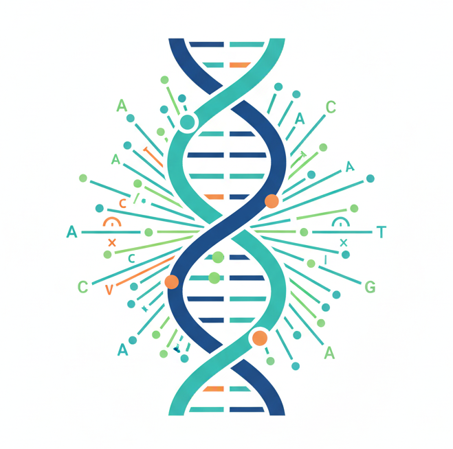

  
  <h1 style="color: #007385; font-family: sans-serif;">Bioinformatics Consulting</h1>
  
Turning Data Into Discovery

---
# SC Bioinformatics Consulting - Shu Cheng 
## Bioinformatics Services and Consulting

Labs and biotech companies are often overwhelmed by the sheer volume of genomic, proteomic, and transcriptomic data. A bioinformatics consultant provides the specialized bridge between raw biological samples and actionable insights. Whether you need accuracy benchmarking, customization or PhD-level bioinformatics expertise but aren't ready for a $180k/year full-time hire, I bridge that talent gap. 

## What I Do

I provide practical bioinformatics support, including:

- RNA-seq, genomic, and metagenomic data analysis  

- Data quality control and troubleshooting  

- Custom, reproducible pipelines (Nextflow)  

- Exploratory analysis and visualization  

- Analysis documentation and methods support  

## About Me: The Bridge Between Biology and Big Data

I am a Bioinformatics Consultant, with 18 years of bioinformatics experience, dedicated to helping researchers and biotech innovators navigate the complexities of high-throughput sequencing. I am a hybrid expert—someone understands the biological "wet lab" context but possesses the high-level computational "dry lab" skills to process the data.

I value tailored bioinformatics workflows, reproducibility, as well as efficient problem-solving.

## 🤝 How We Can Work Together: Flexible Engagement Options

- Short-term analysis projects  

- Pipeline review, optimization, and validation  

- Ongoing consulting or technical support  

- NDA-friendly collaboration

- Remote work

## Ready to unlock your genomic insights?

If you would like to discuss your experimental design and data goals, please submit an inquiry on the page  
<a href="https://sc-bioinformatics-consulting.netlify.app/" target="_blank">Let’s Turn Your Data Into Discovery</a>.

